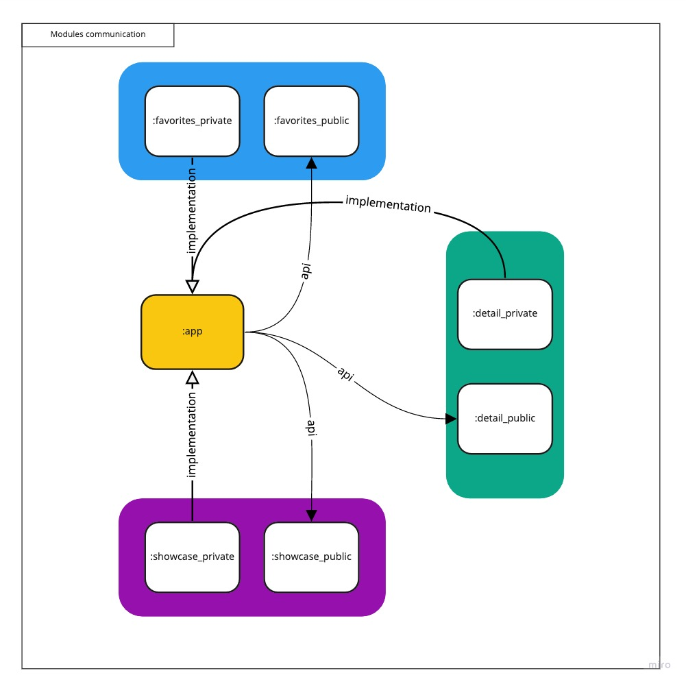

# 🎥 Moovie

🚧 - EM CONSTRUÇÃO -🚧

O app ainda está em desenvolvimento e tem como intuito colocar em prática algumas ferramentas e
técnicas que estão em alta no mundo Android, além de melhorar algumas skills. A ideia é que usemos
os seguintes stack de componentes:

- [X] Dynamic features
- [X] Motion layout
- [X] Navigation
- [X] Coroutines
- [X] ViewModel
- [X] Single Activity
- [X] Dagger 2 (futuramente migrarei para o HILT. Escolhi o dagger por ser mais complexo de
  configurar, forçando o aprendizado)
- [X] Mockk
- [X] JUnit
- [X] Jenkins
- [ ] Dark Mode
- [ ] Espresso
- [ ] Gradle KTS
- [ ] Compose

### 🚀 Como está estruturado o projeto?

- **Módulo app:** possui a estrutura de navegação e a parte central da injeção de dependencias.
- **Módulo core:** centraliza componentes cruciais para toda a aplicação, como configurações de rede,
  banco, injeção de depêndencias, etc.
- **Módulo commons:** possui estruturas comuns para a aplicação, como componentes, definições base,
  estilos, etc.
- **Módulos de libraries:** são módulos que podem ser extraídos e usados por outras aplicações, são
  interessantes pois fomentam a criação de bibliotecas para a comunidade.
- **Módulos de features:** são módulos dividos em duas partes. O modulo privado que contém as telas,
  regras de exibição e comunicação com banco e api. Já o módulo público contém os models, interfaces
  e o use case que poderão ser providos para outras partes do app.

### ☕ Pontos importantes:

O grafo das depêndencias do gradle está sendo otimizado, por ser algo novo, conforme o projeto
evolui algumas adequações precisam ser feitas, porém hoje o projeto está seguindo o seguinte padrão.
Observe que os módulos publicos das features precisaram ser incorporados no :app como APIs, tal ação
é necessária para que não tenhamos dependencias circulares no projeto, inviabilizando a sua
compilação.

## 😄 Seja um dos contribuidores 

Quer fazer parte desse projeto? Abra uma PR com sua contribuição.

## 📝 Licença

Esse projeto está sob licença. Veja o arquivo [LICENÇA](LICENSE.md) para mais detalhes.

[⬆ Voltar ao topo](#-moovie) 

