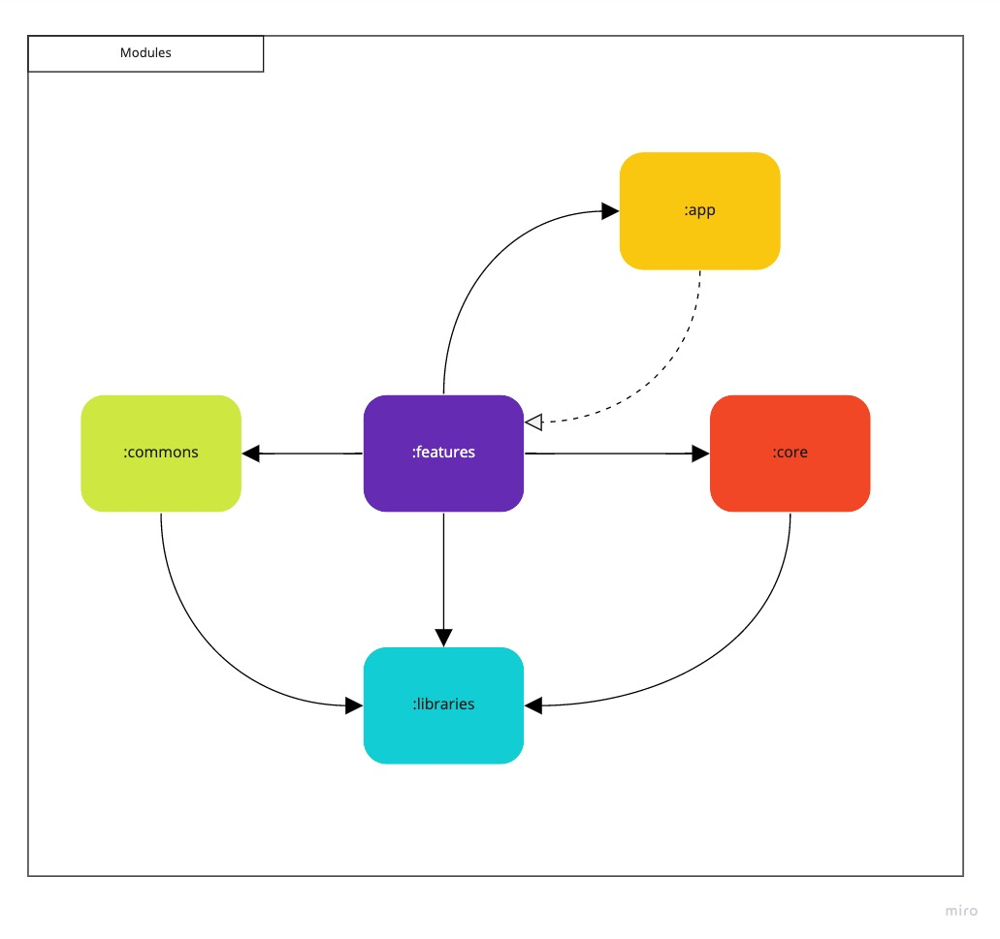

# 🎥 Moovie

[](https://app.bitrise.io/app/50048ce64c66deec)


🚧 &nbsp;In Progress 🚧 

This app is being developed and it has as its goal to practice new Android tools, libs, and techniques. 
If you liked this initiative, please star it and contribute to improving it.

We are using the components below:
- [X] Dynamic features
- [X] Motion layout
- [X] Navigation
- [X] Coroutines
- [X] ViewModel
- [X] Single Activity
- [X] Dagger 2
- [X] Mockk
- [X] JUnit
- [X] Jenkins / Bitrise
- [ ] MVI
- [ ] Paging
- [ ] Espresso
- [ ] Compose

## 💻  Environment setup:

First of all, you need Android Studio 2020.3.1 or later and JDK 11.
Create a developer key in [TheMovieDB](https://www.themoviedb.org/?language=pt-BR) to build the project.
When you get the key, add it in `local.properties` file, as below:

```properties
#TheMovieDB API KEY
api.key=<insert-here>
```
<br>

## :house: What is the project architecture?

This project follows clean architecture concepts ([see more here](https://fernandocejas.com/2018/05/07/architecting-android-reloaded/)). Another inspiration to start this project was [VMadalin project](https://github.com/vmadalin/android-modular-architecture)
Using this architecture we have a lot of benefits such as decoupling code, ease of maintenance, good package structure, single responsibilities for each module, and a high possibility of testing the application. 

Here we can see the link between the app layers and their respective modules.

App architecture           |  Clean architecture
:-------------------------:|:-------------------------:
  |  


## 🚀 What modules does the app contain?



- **App module:** App contains the structure responsible for navigation and dependency injection.
- **Core module:** Core has the main components of the application, such as network configurations, database, dependency injection, etc.
- **Commons module:** Coomons contains common structures such as widgets, extensions, styles, etc.
- **Libraries modules:** Libraries are modules that can be exported as libraries to help other developers and projects.
- **Feature modules:** Features are modules related to the presentation layer and explained better below.

## 💡 How is a feature organization?

Features are divided into three packages, it was done to decouple the Android framework and business rules. Below we can see an explanation about each module and their links.


We have created Gradle plugins using Groovy to generalize each module configuration.
- moovie.feature-data
- moovie.feature-presentation
- moovie.feature.domain

## ☕ How does the communication between feature modules and app module?

The communication is done like the image below, and it was thought in a way to allow us to create dynamic modules using [Android dynamic features](https://developer.android.com/guide/playcore/feature-delivery).


## 🐛 Generating versions and other Gradle configurations

To generate new app versions and help us increment the version code and version name, we have created a task called `generateNewVersion`. It allows tools like Jenkins to execute this Gradle task when generating a new release.
Gradle files were not reviewed and can have a lot of ways to be improved.

## 😄 Become a contributor<br>

Do you wish to be part of this project? Open a pull request with your contribution.

## 📝 License

This project contains licenses. Look at the file [LICENSE](LICENSE.md) for more details.

[⬆ Back to begin](#-moovie)<br>

